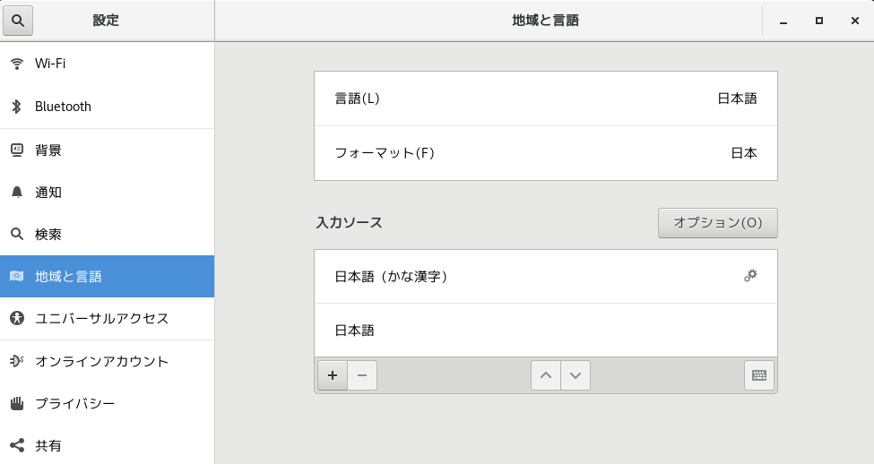
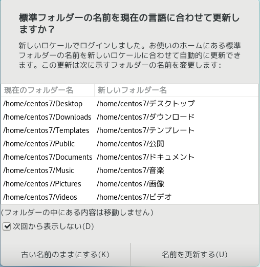

# CentOS 7 Settings

## Environment

||Version|
|:--:|:--:|
|Host|Windows10 Pro 22H2|
|VirtualBox|7.0.6|
|Guest Additions|7.0.6|
|kernel|Linux centos7 3.10.0-1160.88.1.el7.x86_64|
|OS Core|CentOS Linux release 7.9.2009 (Core)|

## Keyboard Settings



[CentOS 7でキーボードを日本語配列にできず記号入力等で困る事象の対処](https://nashikachi.hatenablog.com/entry/2022/06/04/172418)

日本語配列のキーボードに設定する

``` bash
$ localectl set-keymap jp106
```

``` bash
$ localectl status
   System Locale: LANG=ja_JP.UTF-8
       VC Keymap: jp106
      X11 Layout: jp
       X11 Model: jp106
     X11 Options: terminate:ctrl_alt_bksp
```

[キーボードの種類](http://qa.elecom.co.jp/faq_detail.html?id=5262)

## Rename Folder Names jp to en

``` bash
$ LANG=C xdg-user-dirs-gtk-update
Gtk-Message: 17:59:42.048: GtkDialog mapped without a transient parent. This is discouraged.
Moving DESKTOP directory from デスクトップ to Desktop
Moving DOWNLOAD directory from ダウンロード to Downloads
Moving TEMPLATES directory from テンプレート to Templates
Moving PUBLICSHARE directory from 公開 to Public
Moving DOCUMENTS directory from ドキュメント to Documents
Moving MUSIC directory from 音楽 to Music
Moving PICTURES directory from 画像 to Pictures
Moving VIDEOS directory from ビデオ to Videos
```



``` bash
$ cat .config/user-dirs.dirs
# This file is written by xdg-user-dirs-update
# If you want to change or add directories, just edit the line you're
# interested in. All local changes will be retained on the next run
# Format is XDG_xxx_DIR="$HOME/yyy", where yyy is a shell-escaped
# homedir-relative path, or XDG_xxx_DIR="/yyy", where /yyy is an
# absolute path. No other format is supported.
# 
XDG_DESKTOP_DIR="$HOME/Desktop"
XDG_DOWNLOAD_DIR="$HOME/Downloads"
XDG_TEMPLATES_DIR="$HOME/Templates"
XDG_PUBLICSHARE_DIR="$HOME/Public"
XDG_DOCUMENTS_DIR="$HOME/Documents"
XDG_MUSIC_DIR="$HOME/Music"
XDG_PICTURES_DIR="$HOME/Pictures"
XDG_VIDEOS_DIR="$HOME/Videos"
```

``` bash
$ cat .config/user-dirs.locale 
ja_JP
$ vim .config/user-dirs.locale
$ cat .config/user-dirs.locale 
en_US
```

## Display Settings

ディスプレイ解像度に`1920 x 1080`を追加

``` bash
$ xrandr
Screen 0: minimum 1 x 1, current 1680 x 1050, maximum 8192 x 8192
Virtual1 connected primary 1680x1050+0+0 (normal left inverted right x axis y axis) 0mm x 0mm
   1024x768      60.00 +  60.00
   2560x1600     59.99
   1920x1440     60.00
   1856x1392     60.00
   1792x1344     60.00
   1920x1200     59.88
   1600x1200     60.00
   1680x1050     59.95*
   1400x1050     59.98
   1280x1024     60.02
   1440x900      59.89
   1280x960      60.00
   1360x768      60.02
   1280x800      59.81
   1152x864      75.00
   1280x768      59.87
   800x600       60.32
   640x480       59.94
```

追加したい解像度を自動算出

``` bash
$ cvt 1920 1080
# 1920x1080 59.96 Hz (CVT 2.07M9) hsync: 67.16 kHz; pclk: 173.00 MHz
Modeline "1920x1080_60.00"  173.00  1920 2048 2248 2576  1080 1083 1088 1120 -hsync +vsync
```

解像度の一時的な設定変更

``` bahs
$ xrandr --newmode "1920x1080_60.00"  173.00  1920 2048 2248 2576  1080 1083 1088 1120 -hsync +vsync
$ xrandr --addmode Virtual1 "1920x1080_60.00"
$ xrandr --output Virtual1 --mode "1920x1080_60.00"
```

恒久的に解像度を変更する

``` bash
$ vim /etc/gdm/Init/Default
#!/bin/sh
# Stolen from the debian kdm setup, aren't I sneaky
# Plus a lot of fun stuff added
#  -George

PATH="/usr/bin:$PATH"
OLD_IFS=$IFS

# これを追加
/usr/bin/xrandr --newmode "1920x1080_60.00"  173.00  1920 2048 2248 2576  1080 1083 1088 1120 -hsync +vsync
/usr/bin/xrandr --addmode Virtual1 "1920x1080_60.00"
/usr/bin/xrandr --output Virtual1 --mode "1920x1080_60.00"
# ここまで
```

[【CentOS】モニター解像度の設定する方法](https://renoji.com/IT.php?Contents=OS_CentOS/Setting_Monitor.html)

## Share Folder

``` bash
$ sudo mount -t vboxsf centos7 /mnt
[sudo] centos7 のパスワード:
/sbin/mount.vboxsf: mounting failed with the error: No such device
```

``` bash
$ ll /sbin/mount.vboxsf
lrwxrwxrwx. 1 root root 48  3月 18 15:05 /sbin/mount.vboxsf -> /opt/VBoxGuestAdditions-7.0.6/other/mount.vboxsf
```

``` bash
$ cat /var/log/vboxadd-setup.log
modprobe vboxguest failed
```

``` bash
$ sudo yum update kernel
[sudo] centos7 のパスワード:
読み込んだプラグイン:fastestmirror, langpacks
Loading mirror speeds from cached hostfile
 * base: ftp.iij.ad.jp
 * extras: ftp.iij.ad.jp
 * updates: ftp.iij.ad.jp
No packages marked for update
```

``` bash
$ sudo yum -y install kernel-devel kernel-headers dkms gcc gcc-c++
読み込んだプラグイン:fastestmirror, langpacks
Loading mirror speeds from cached hostfile
 * base: ftp.iij.ad.jp
 * extras: ftp.iij.ad.jp
 * updates: ftp.iij.ad.jp
パッケージ dkms は利用できません。
依存性の解決をしています
--> トランザクションの確認を実行しています。
---> パッケージ gcc.x86_64 0:4.8.5-44.el7 を インストール
--> 依存性の処理をしています: cpp = 4.8.5-44.el7 のパッケージ: gcc-4.8.5-44.el7.x86_64
--> 依存性の処理をしています: glibc-devel >= 2.2.90-12 のパッケージ: gcc-4.8.5-44.el7.x86_64
---> パッケージ gcc-c++.x86_64 0:4.8.5-44.el7 を インストール
--> 依存性の処理をしています: libstdc++-devel = 4.8.5-44.el7 のパッケージ: gcc-c++-4.8.5-44.el7.x86_64
---> パッケージ kernel-devel.x86_64 0:3.10.0-1160.88.1.el7 を インストール
---> パッケージ kernel-headers.x86_64 0:3.10.0-1160.88.1.el7 を インストール
--> トランザクションの確認を実行しています。
---> パッケージ cpp.x86_64 0:4.8.5-44.el7 を インストール
---> パッケージ glibc-devel.x86_64 0:2.17-326.el7_9 を インストール
--> 依存性の処理をしています: glibc-headers = 2.17-326.el7_9 のパッケージ: glibc-devel-2.17-326.el7_9.x86_64
--> 依存性の処理をしています: glibc-headers のパッケージ: glibc-devel-2.17-326.el7_9.x86_64
---> パッケージ libstdc++-devel.x86_64 0:4.8.5-44.el7 を インストール
--> トランザクションの確認を実行しています。
---> パッケージ glibc-headers.x86_64 0:2.17-326.el7_9 を インストール
--> 依存性解決を終了しました。

依存性を解決しました

================================================================================
 Package              アーキテクチャー
                                  バージョン                 リポジトリー  容量
================================================================================
インストール中:
 gcc                  x86_64      4.8.5-44.el7               base          16 M
 gcc-c++              x86_64      4.8.5-44.el7               base         7.2 M
 kernel-devel         x86_64      3.10.0-1160.88.1.el7       updates       18 M
 kernel-headers       x86_64      3.10.0-1160.88.1.el7       updates      9.1 M
依存性関連でのインストールをします:
 cpp                  x86_64      4.8.5-44.el7               base         5.9 M
 glibc-devel          x86_64      2.17-326.el7_9             updates      1.1 M
 glibc-headers        x86_64      2.17-326.el7_9             updates      691 k
 libstdc++-devel      x86_64      4.8.5-44.el7               base         1.5 M

トランザクションの要約
================================================================================
インストール  4 パッケージ (+4 個の依存関係のパッケージ)

総ダウンロード容量: 60 M
インストール容量: 122 M
Downloading packages:
No Presto metadata available for updates
(1/8): glibc-headers-2.17-326.el7_9.x86_64.rpm             | 691 kB   00:05
(2/8): glibc-devel-2.17-326.el7_9.x86_64.rpm               | 1.1 MB   00:05
(3/8): gcc-c++-4.8.5-44.el7.x86_64.rpm                     | 7.2 MB   00:13
(4/8): cpp-4.8.5-44.el7.x86_64.rpm                         | 5.9 MB   00:16
(5/8): libstdc++-devel-4.8.5-44.el7.x86_64.rpm             | 1.5 MB   00:09
(6/8): kernel-headers-3.10.0-1160.88.1.el7.x86_64.rpm      | 9.1 MB   00:20
(7/8): kernel-devel-3.10.0-1160.88.1.el7.x86_64.rpm        |  18 MB   00:24
(8/8): gcc-4.8.5-44.el7.x86_64.rpm                         |  16 MB   00:30
--------------------------------------------------------------------------------
合計                                               2.0 MB/s |  60 MB  00:30
Running transaction check
Running transaction test
Transaction test succeeded
Running transaction
  インストール中          : kernel-headers-3.10.0-1160.88.1.el7.x86_64      1/8
  インストール中          : glibc-headers-2.17-326.el7_9.x86_64             2/8
  インストール中          : glibc-devel-2.17-326.el7_9.x86_64               3/8
  インストール中          : libstdc++-devel-4.8.5-44.el7.x86_64             4/8
  インストール中          : cpp-4.8.5-44.el7.x86_64                         5/8
  インストール中          : gcc-4.8.5-44.el7.x86_64                         6/8
  インストール中          : gcc-c++-4.8.5-44.el7.x86_64                     7/8
  インストール中          : kernel-devel-3.10.0-1160.88.1.el7.x86_64        8/8
  検証中                  : gcc-c++-4.8.5-44.el7.x86_64                     1/8
  検証中                  : glibc-devel-2.17-326.el7_9.x86_64               2/8
  検証中                  : cpp-4.8.5-44.el7.x86_64                         3/8
  検証中                  : glibc-headers-2.17-326.el7_9.x86_64             4/8
  検証中                  : gcc-4.8.5-44.el7.x86_64                         5/8
  検証中                  : kernel-devel-3.10.0-1160.88.1.el7.x86_64        6/8
  検証中                  : libstdc++-devel-4.8.5-44.el7.x86_64             7/8
  検証中                  : kernel-headers-3.10.0-1160.88.1.el7.x86_64      8/8

インストール:
  gcc.x86_64 0:4.8.5-44.el7
  gcc-c++.x86_64 0:4.8.5-44.el7
  kernel-devel.x86_64 0:3.10.0-1160.88.1.el7
  kernel-headers.x86_64 0:3.10.0-1160.88.1.el7

依存性関連をインストールしました:
  cpp.x86_64 0:4.8.5-44.el7              glibc-devel.x86_64 0:2.17-326.el7_9
  glibc-headers.x86_64 0:2.17-326.el7_9  libstdc++-devel.x86_64 0:4.8.5-44.el7

完了しました!
```

``` bash
$ sudo mount -t vboxsf centos7 /mnt
[sudo] centos7 のパスワード:
$ ls /mnt/
host.txt
```

``` bash
$ sudo chmod 700 /mnt
```

[VirtualBox Guest Additions エラー対処法 （CentOS）](https://engineer-log.net/index.php/2016/06/06/post-281/)

[VirtualBoxの共有フォルダのマウントに失敗する](https://qiita.com/amagitakayosi/items/07ff50afac1cd6f62c1f)

[VirtualBoxでフォルダーをマウントし共有する方法](https://legendimposter.hatenablog.jp/entry/2020/08/26/170022)

[Linux ディレクトリのパーミッション（アクセス権）について](https://turningp.jp/server-client/linux/directory-permission)

## upgrade gcc

``` bash
$ gcc --version
gcc バージョン 4.8.5
```

``` bash
$ sudo yum install gcc-c++
$ cd /usr/local/src
```

``` bash
$ sudo curl -O http://ftp.tsukuba.wide.ad.jp/software/gcc/releases/gcc-12.2.0/gcc-12.2.0.tar.gz
$ sudo tar -xvzf gcc-12.2.0.tar.gz
$ cd /usr/local/src/gcc-12.2.0/
$ sudo ./contrib/download_prerequisites
$ sudo mkdir build
$ cd build
```

``` bash
$ sudo ../configure --enable-languages=c,c++ --prefix=/usr/local --disable-bootstrap --disable-multilib../configure --enable-languages=c,c++ --prefix=/usr/local --disable-bootstrap --disable-multilib
$ sudo make
$ sudo make install
$ /usr/local/bin/gcc --version
```

``` bash
$ sudo vim /etc/ld.so.conf
# Add
/usr/local/lib64
$ sudo ldconfig -v
```

``` bash
$ cd /etc/ld.so.conf.d
$ sudo vim usr-local-lib64.conf
# Add
/usr/local/lib64
```

``` bash
$ sudo ldconfig -v
```

``` bash
$ cd ~
$ gcc --version
gcc (GCC) 12.2.0
Copyright (C) 2022 Free Software Foundation, Inc.
This is free software; see the source for copying conditions.  There is NO
warranty; not even for MERCHANTABILITY or FITNESS FOR A PARTICULAR PURPOSE.
$ sudo reboot
```

## upgrade kernel

``` bash
$ cd /usr/local/src
$ sudo curl -O https://cdn.kernel.org/pub/linux/kernel/v5.x/linux-5.19.9.tar.xz
$ sudo xz -d linux-5.19.9.tar.xz
$ sudo tar xvf linux-5.19.9.tar
$ cd linux-5.19.9/
```

``` bash
$ ls /boot/
System.map-3.10.0-1160.88.1.el7.x86_64
System.map-3.10.0-1160.el7.x86_64
config-3.10.0-1160.88.1.el7.x86_64
config-3.10.0-1160.el7.x86_64
efi
grub
grub2
initramfs-0-rescue-3373971e1f8bfa4b82eea8d99a71461d.img
initramfs-3.10.0-1160.88.1.el7.x86_64.img
initramfs-3.10.0-1160.88.1.el7.x86_64kdump.img
initramfs-3.10.0-1160.el7.x86_64.img
initramfs-3.10.0-1160.el7.x86_64kdump.img
symvers-3.10.0-1160.88.1.el7.x86_64.gz
symvers-3.10.0-1160.el7.x86_64.gz
vmlinuz-0-rescue-3373971e1f8bfa4b82eea8d99a71461d
vmlinuz-3.10.0-1160.88.1.el7.x86_64
vmlinuz-3.10.0-1160.el7.x86_64
```

``` bash
$ sudo cp -p /boot/config-3.10.0-1160.el7.x86_64 ./.config
OR
$ sudo cp -p /boot/config-3.10.0-1160.88.1.el7.x86_64 ./.config
[sudo] centos7 のパスワード:$ sudo cp -p /boot/config-3.10.0-1160.el7.x86_64 ./.config
[sudo] centos7 のパスワード:
```

``` bash
$ cd /usr/local/src/linux-5.19.9/

```

[shell - Bash weirdness when printing ${IFS@Q} - Stack Overflow](https://stackoverflow.com/questions/46019083/bash-weirdness-when-printing-ifsq)

[How to Update Bash on CentOS 6 and CentOS 7 - Liquid Web](https://www.liquidweb.com/kb/how-to-update-bash-on-centos-6-and-centos-7/)

[yum clean コマンドでキャッシュ削除・アップデートのチェックと実行 〜 CentOS6 | EasyRamble](https://easyramble.com/yum-clean-and-update.html)

[Linuxのカーネルバージョンを確認する](https://www.linuxmaster.jp/linux_skill/2018/01/post-175.html)

[kernelとgccのアップデート CentOS7 | Node4u ノードフォーユー：100Mbps,1Gbps,10Gbps高帯域保証レンタルサーバー](https://node4u.info/2022/07/03/kernel%e3%81%a8gcc%e3%81%ae%e3%82%a2%e3%83%83%e3%83%97%e3%83%87%e3%83%bc%e3%83%88%e3%80%80centos7/)

[centos7のkernelアップデート - Qiita](https://qiita.com/29_nickey/items/c87347fd0c851e3a0877)

[Index of /software/gcc/releases/gcc-12.2.0/](http://ftp.tsukuba.wide.ad.jp/software/gcc/releases/gcc-12.2.0/)

[Index of /pub/linux/kernel/v5.x/](https://cdn.kernel.org/pub/linux/kernel/v5.x/)

[linux-5.17 の CentOS Linux release 7.3 へのインストール｜May｜note](https://note.com/yamblue/n/nefc0f9795966)

[CentOS 7.3にGCC 11をインストール (SCL)｜May｜note](https://note.com/yamblue/n/nee1d2f34286a)

[「/bin」「/usr/bin」「/usr/local/bin」ディレクトリの使い分け - Linux技術者認定 LinuC | LPI-Japan](https://linuc.org/study/knowledge/544/)

[gccの-rdynamic option 調査メモ - Qiita](https://qiita.com/takeoverjp/items/14fdf7ab0d0a76d83d30)

[Index of /gnu/bash](https://ftp.gnu.org/gnu/bash/)
